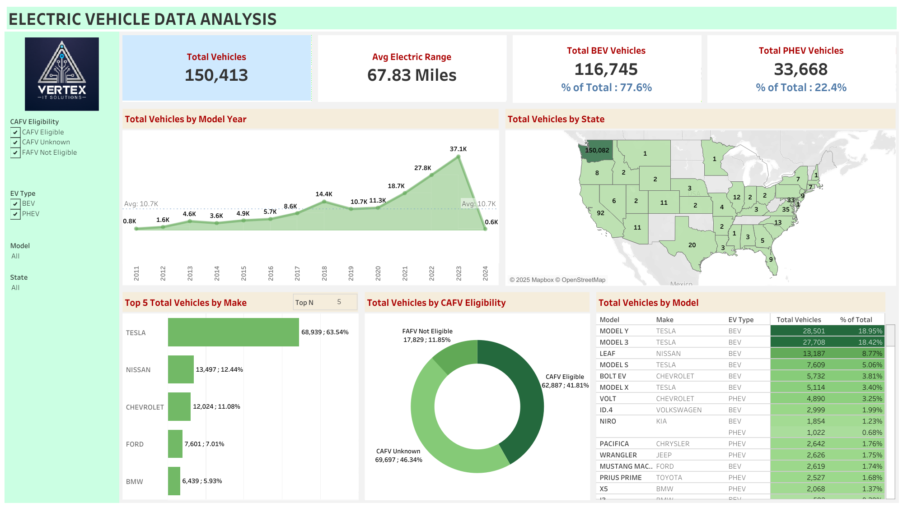

# Electric Vehicle Data Analysis Dashboard

This project presents a Tableau dashboard that analyzes the electric vehicle (EV) population data for Washington State, USA. The dashboard visualizes trends in EV adoption by vehicle make, model year, range, location, and eligibility for clean fuel programs.

## 🔍 Overview
The dashboard provides:
- Interactive filters by model year, county, make, MSRP, and vehicle type (BEV/PHEV)
- Key performance indicators such as total EVs, average electric range, average MSRP, and BEV ratio
- A geographic distribution of EVs on a map
- Visual breakdown of vehicle type trends, popular makes, and range distribution

## 📸 Dashboard Preview

## 📁 Files
- `Electric_Vehicle_Population_Data.csv`: Raw dataset used in the dashboard
- `ElectricVehicleDashboard.twb`: Tableau workbook containing the dashboard design
- `dashboard.png`: Image preview of the Tableau dashboard

## 📊 View Live Dashboard
You can interact with the dashboard here:  
👉 [Electric Vehicle Tableau Dashboard](https://public.tableau.com/app/profile/md.jahid.hassan/viz/ElectricVehicleDataAnalysis_17505309845910/Dashboard1?publish=yes)

## 💻 How to Use
1. Clone this repository or download the files
2. Open `ElectricVehicleDashboard.twb` in Tableau Desktop or Tableau Public
3. Load the dataset `Electric_Vehicle_Population_Data.csv` into Tableau
4. Explore or extend the dashboard for your use case

## 🧾 Dataset Source

Data sourced from:  
[Washington State Government – Electric Vehicle Population](https://catalog.data.gov/dataset/electric-vehicle-population-data)

## 🙋‍♂️ About Me

**Md. Jahid Hassan**  
Data Analyst | Data Enthusiast  
📧 jahidhsanto@gmail.com  
🔗 [LinkedIn](https://linkedin.com/in/jahidhsanto) | [GitHub](https://github.com/jahidhsanto)

## 📜 License
This project is open-source and available under the [MIT License](LICENSE).
